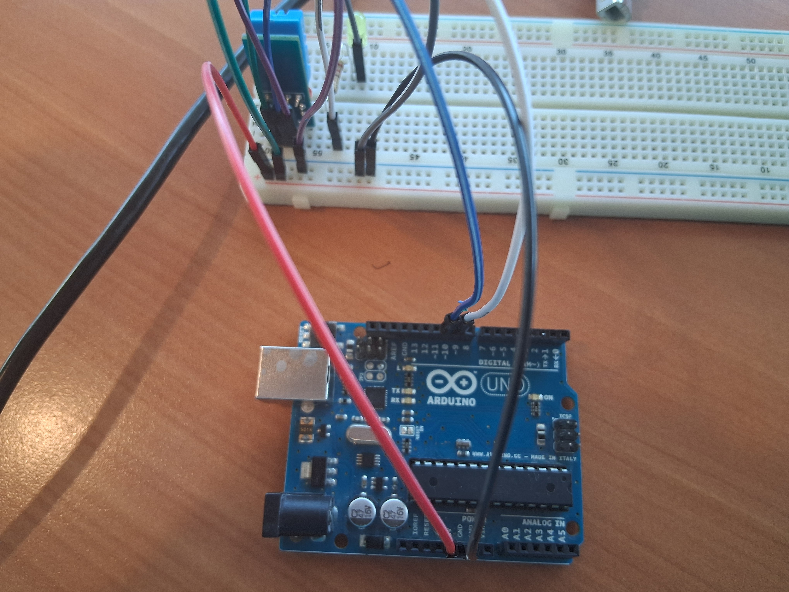
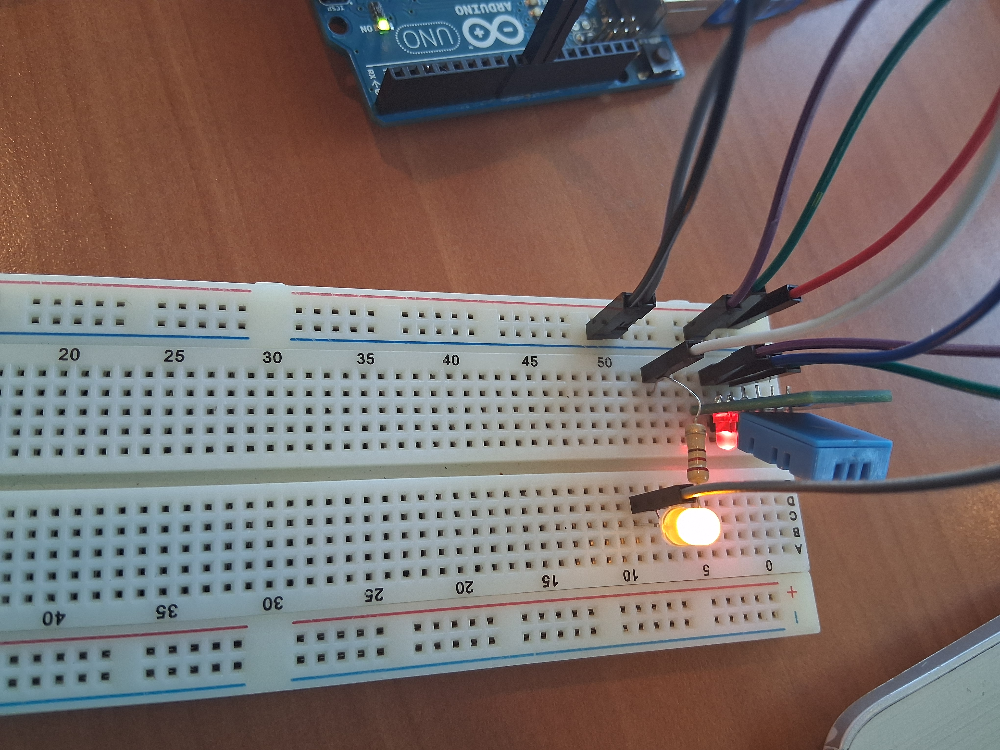
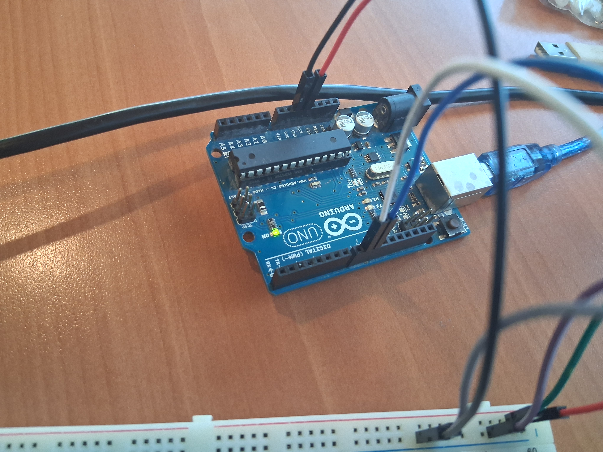
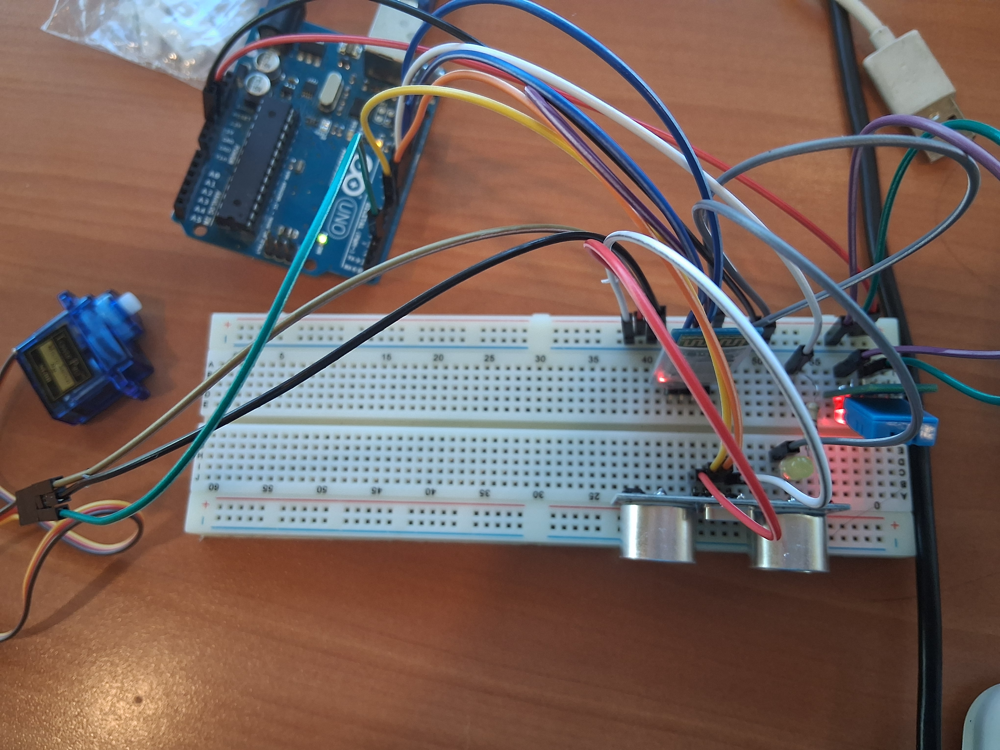
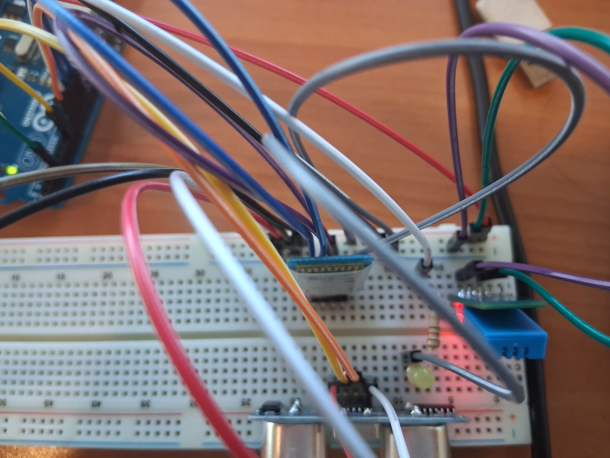
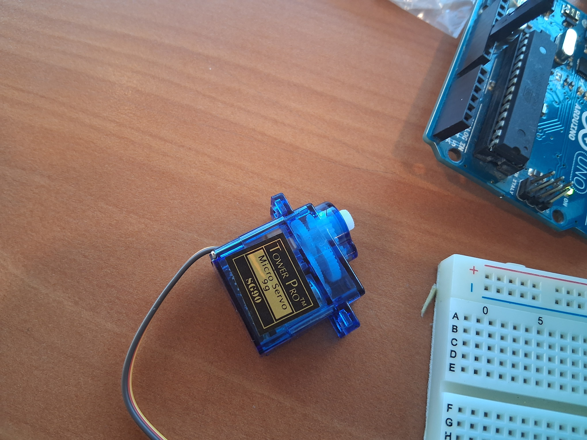

# Sistema IoT de Monitoreo con Control Móvil 📱🤖

Un sistema integral que conecta el mundo físico con el digital mediante sensores Arduino y una App Android nativa. Permite visualizar datos en tiempo real y controlar actuadores vía Bluetooth. Ideal para mascotas, específicamente de cara a alimentos secos, analizando sus variables.    
🐶😺🦆

### 📺 Demo en Funcionamiento
¡Mira el sistema en acción! Haz clic en la imagen para ver el video:

![Video] (https://drive.google.com/file/d/17_jOSG6u9-Yn5VxzYRXbwo2-z2isewPP/view?usp=sharing)

---

### 📸 Galería
Aquí puedes ver la interfaz de la aplicación y el montaje físico.

| Arduino Uno | Circuito Conectado |
| :---: | :---: |
|  |  |  |  |  |  |  |  |

---

### 🚀 Características Técnicas
* Conectividad: Comunicación Serial Bluetooth (HC-05).
* Hardware: Arduino Uno.
* App Móvil: Desarrollada en Android Studio (Java/Kotlin).
* Funcionalidades: Lectura de sensores en tiempo real, control de relés.

### 🛠 Instalación
1. Carga el código `.ino` en tu Arduino.
2. Abre la carpeta `app` en Android Studio.
3. Compila y ejecuta.

---
### Autor: Víctor Raquileo Rueda
---
